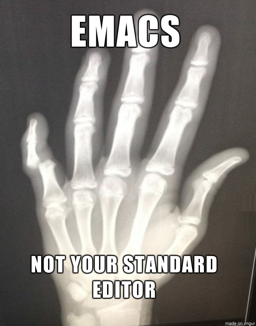
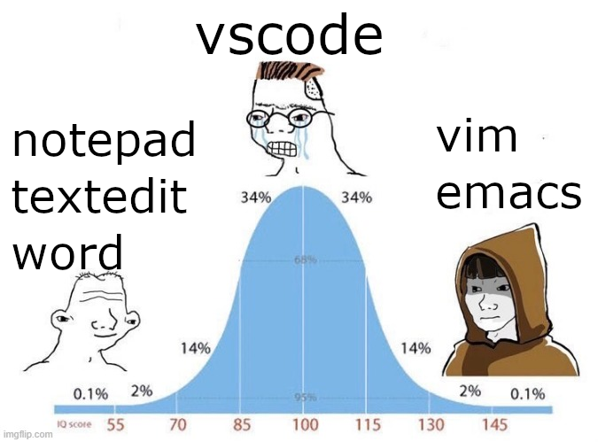
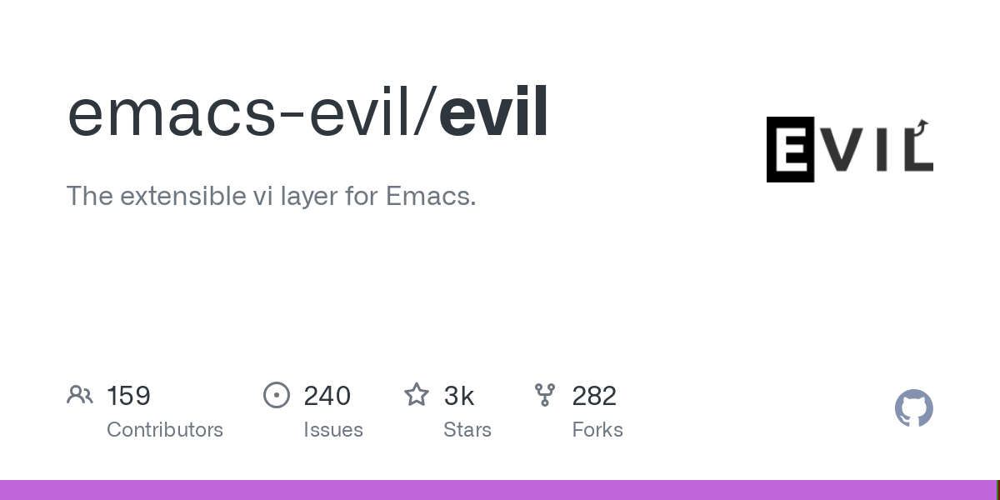
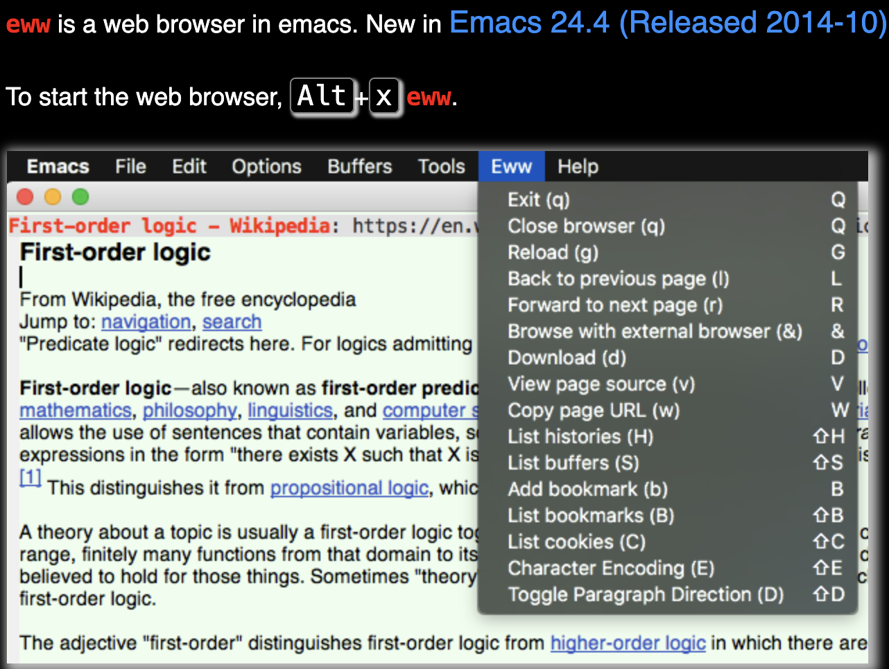
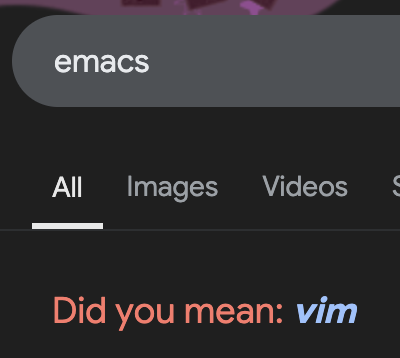

# Technology Tinder
### Emacs and Vim
### [https://pocket-98.github.io/ATLS5410/wk01/technology_tinder.html](https://pocket-98.github.io/ATLS5410/wk01/technology_tinder.html)
### Pocket
### 2025-01-22
### v1.2 (2025-01-23)

----

## Introduction
Emacs and Vim are both computer text editors that were developed starting from the 1970's.
Computer nerds have strong opinions about favoring one or the other and it is one of the oldest debates there is.
Fundamentally, both of them are tools to enable productivity and being proficient at either of these editors can give one the appearance of being a "coding god".

## Swipe Left: Emacs :-1:

* based on a history of hacks, addons, bloat, and maintining compatibility
  * emacs: 1970 spawned from TECO project at MIT AI Lab
  * emacs: 1984 v1 GNU Emacs Richard Stallman with Lisp support
  * emacs: 2024 v29.4 GNU project, different developers
* bulky software that is unusable without extreme modification
* huge learning curve
* known for causing physical ailment: emacs pinky
  * 
* encourages cult like behavior: the church of emacs
* violates the principles and foundations of unix philosophy: programs should be small, efficient and do 1 thing extremely well
* possible acronyms
   * EMACS Makes Any Computer Slow
   * Escape Meta Alt Control Shift
   * Eight Megabytes And Constantly Swapping

## Swipe Right: Vim :+1:

* based on a history of standards, improvement, customs and sound philosophy:
  * ed: 1969 Bell Labs
  * ex: 1976 Bill Joy for POSIX
  * vi: 1979 Bill Joy for BSD
  * vim: 1991 Bram Moolenaar, added user scripting in 1998, still actively developed today
  * neovim: 2014 fork to allow multithreading, allows for lua support and plugins
* available in some form on every unix operating system by default including macos
* vim movement keybindings available in variety of other programs
  * obsidian note taking app for mobile devices supports vim bindings
  * vscode supports vim bindings
* 5x more popular consistently according to the [stack overflow developer survey](https://survey.stackoverflow.co/2024/technology#1-integrated-development-environment)

## Comparison
* both are hard to learn and have a barrier to entry, especially in a world where GUIs are the default and terminals can be scary
  * 
* both have 50 years of history influencing the design and structure
  * 
* emacs has an "evil mode" to allow you to use vim keybindings because vim is just that popular; there is no "emacs mode" for vim
  * 
* emacs can act as an entire operating system with connections to servers, shell, browsing the internet, and navigating files
  * 
* google searches for vim result in the question "Did you mean: emacs" and searches for emacs result in "Did you mean: vim".
  * 
