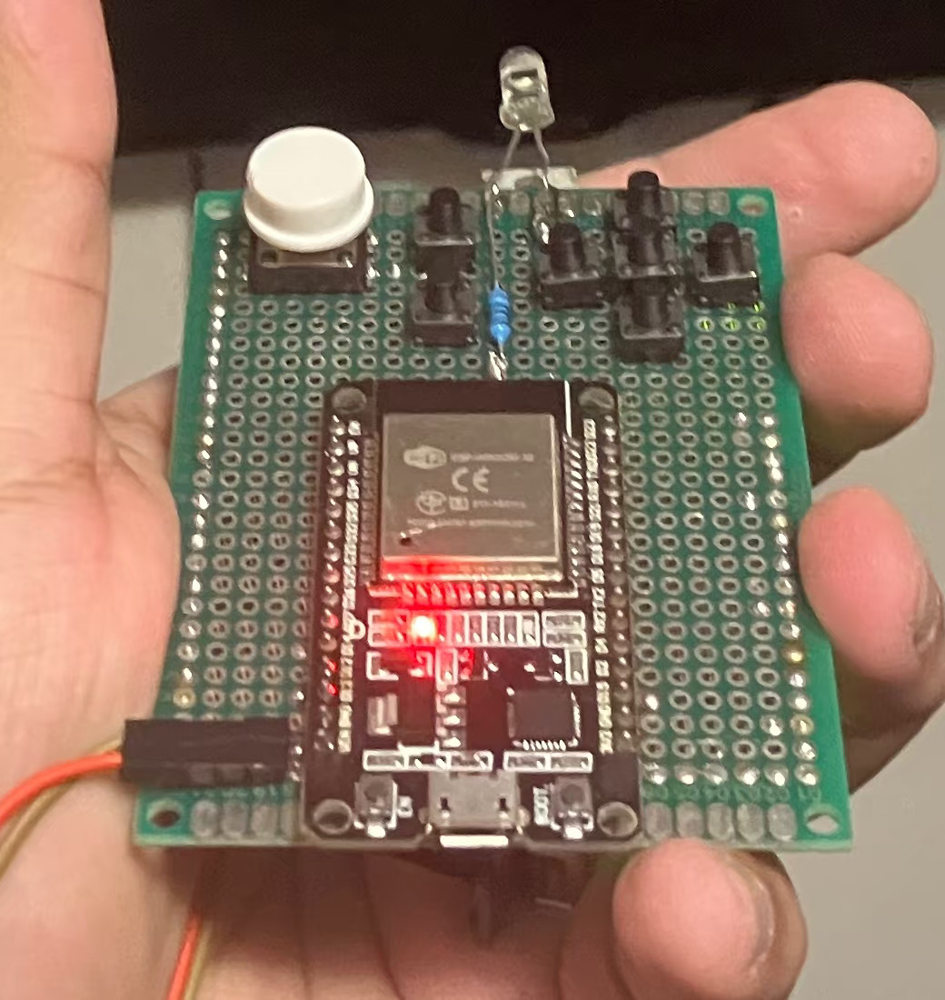
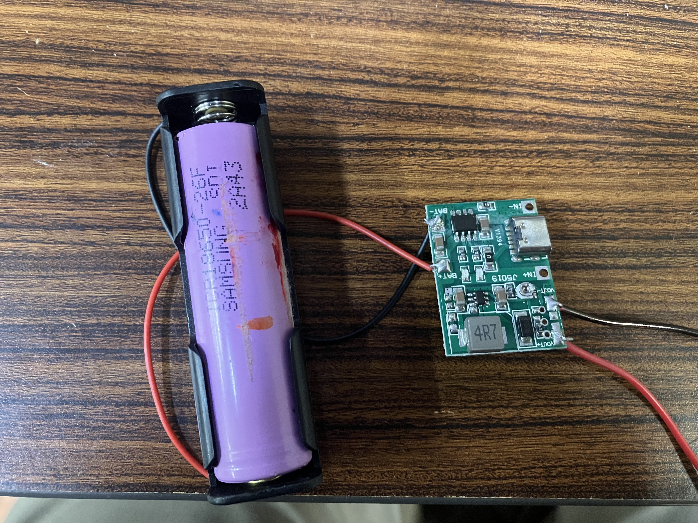
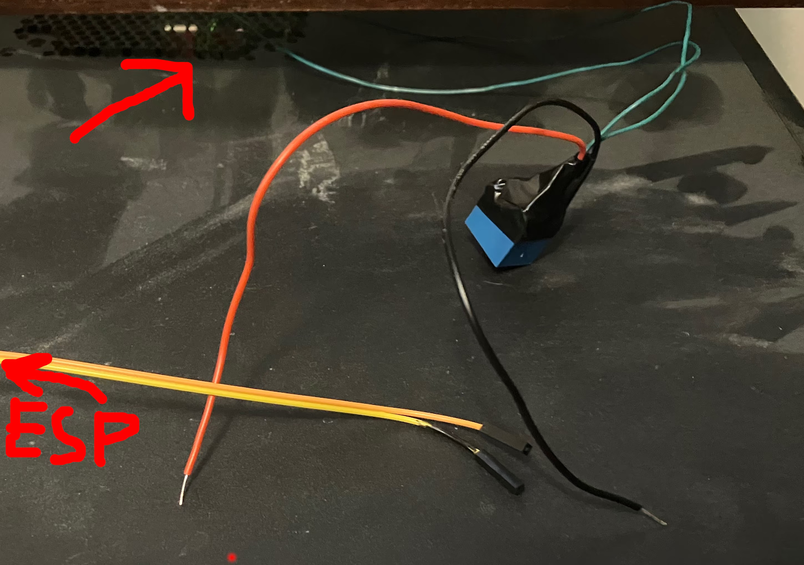
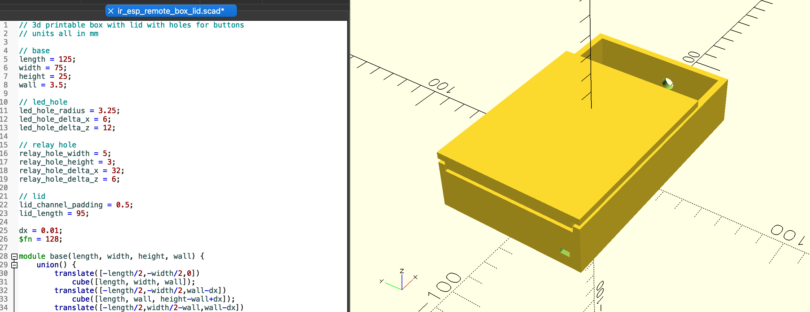
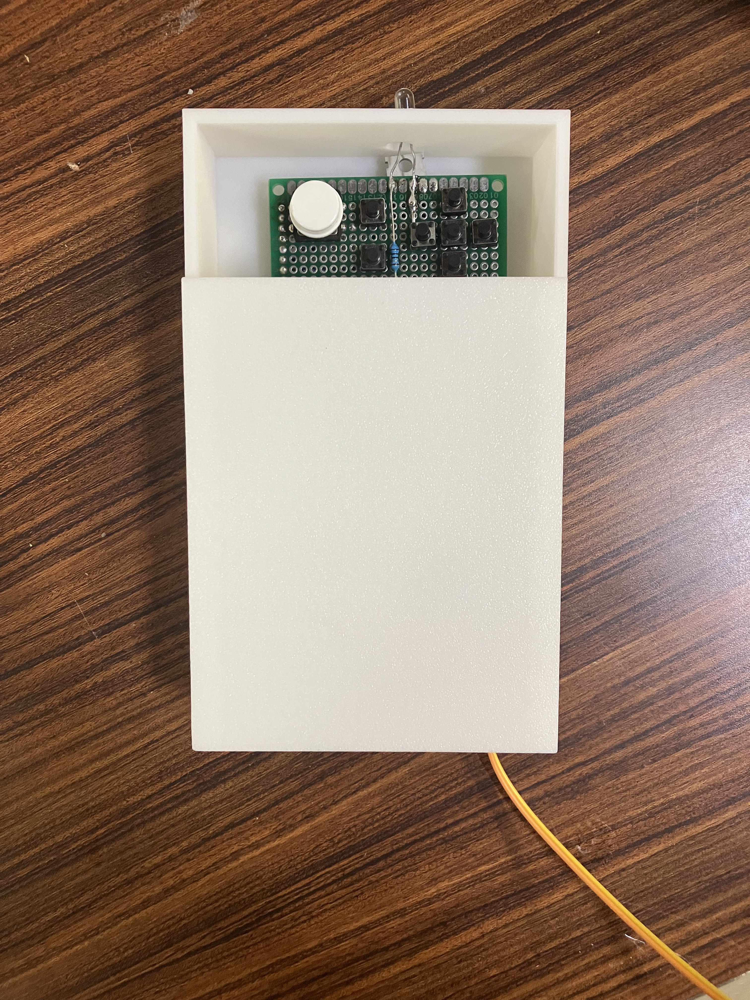

# IDC2 Documentation
### IR TV Remote and Server Rebooter
### [https://pocket-98.github.io/ATLS5410/wk11/documentation.html](https://pocket-98.github.io/ATLS5410/wk11/documentation.html)
### Pocket
### 2025-05-06
### v1.0

---

## Proposal
I lost a TV remote to a samsung smartish TV that is connected to the wifi, so I am able to use the open source project [samsungctl](https://github.com/Ape/samsungctl) running on my laptop to switch inputs. I would rather have a physical remote with buttons that can be used to control the TV instead of having to open up a laptop and typing cli commands. Fixing this pet peeve could be done in 2 ways: by reverse engineering the samsung infrared signals that are sent by an IR blaster from arduino, or by mimicing the same kind of packets sent by the open source library over wifi with an esp32. I would make a couple of physical buttons to connect to either the arduino or the esp32 and then depending on the technology used, send the wifi commands or ir signal. The goal would be to build this for a budget of ~$10 because the universal remote costs $40 at bestbuy.

## Expanded Proposal
I have a desktop running various virtual machines and acting as a media server that has as problem: it was exposed to large amounts of soot and smoke and ever since then, it freezes every couple of days. This is probably a memory problem, but replacing the RAM dimms didn't fix it so I think the motherboard has a problem. My current solution is to reboot it every time it freezes but I wish there was an automatic way to detect when the server freezes and then force a restart. Now that I have this homemade ~~bomb-looking-like~~ tv remote that has an ESP-32 on it, I an expand it's capabilities to also detect when my server goes offline by checking if it can ping the server through it's wifi card. Then when it detects that it is frozen, the tv remote can trigger a relay to act as the push button for restarting the computer. I also propose wrapping the project in a nice 3D printed enclosure.

## Iteration 1
The first iteration of the project was functional but tethered for power and just a bunch of components soldered to a perf board. It would send IR signals to the TV but was tethered for 5V power.

## Iteration 2
The second iteration is a bit more polished: The first step was getting an 18650 Li-ion cell, a charging UPS module, and dialing the settings in to tune it to output the desired voltage for the microcontroller. This board allows the remote to operate either plugged into a usb-c voltage source which charges the battery while the esp32 is running or to disconnect from the voltage source and operate from the battery. From my tests, the remote will function for about 6 hours on one battery's charge.

Then, the logic for connecting to the wifi, and checking periodically if the server is online was implemented. Every minute, the microcontroller will check if it is still on the wifi or not and if after 5 checks in a row, it is still offline, the microcontroller will reboot itself. Similarly, every 30 seconds, the microcontroller will do a tcp request to port 22 on the server and check if the ssh server is accessible on it. If this fails 5 times in a row, then the microcontroller will momentarily trigger a relay to the normally open state which is wired in parallel to the reset button on the motherboard, causing a reboot.

This is a showcase of the functionality where the remote is both triggering a reboot on the pc and also functioning as a TV remote at the same time:

<video width="640" height="480" controls>
  <source src="demo.mp4" type="video/mp4">
  Your browser does not support the video tag.
</video>

Next, an enclosure was modeled that would hold the perfboard, expose the IR LED, and have a slot for the usb c charger. This was done in OpenSCAD so that the parameters of various spots could be programmatically changed similar to the parametric modeling capabilities of Grasshopper and Rhino.

Finally, after the enclosure was printed and the parts were fit into it, this is what the final functioning product looks like:

If I were to refine this project even more, I could design a custom PCB but the
remote as it currently is works very well for my needs. I am very happy with the result and I think it is a good example of how to use a microcontroller to do parallel tasks like checking the status of whether a device is online and then control a relay and also send IR signals. I am also happy with the enclosure design but it could be improved if the buttons were integrated with the lid design.
